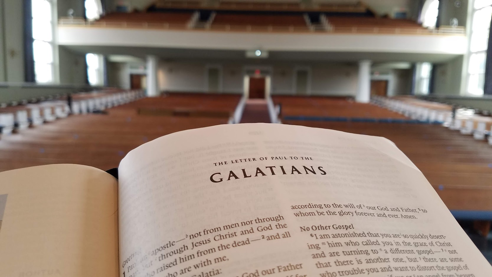

# Bible Exam Practice

Hello, BCM 205/209/317 students,  
Here's a webapp to help you practice for those exams. Here, you'll match bible excerpts to their chapter.

This gives you a randomly chosen excerpt from your chosen book of the bible (NRSV), then you write what chapter, or chapter range, the excerpt is from. Upon guessing, if enabled, the program would write the context surrounding this quote. By default, this is set to 10 words.

For example, here is a nine-word selection from Galatians.

'...I beg you, become as I am, for I...'

You would enter "Chapter 4". The program would write:

The context for this verse is:
'afraid that my work for you may have been wasted. Friends, I beg you, become as I am, for I also have become as you are. You have done me...'